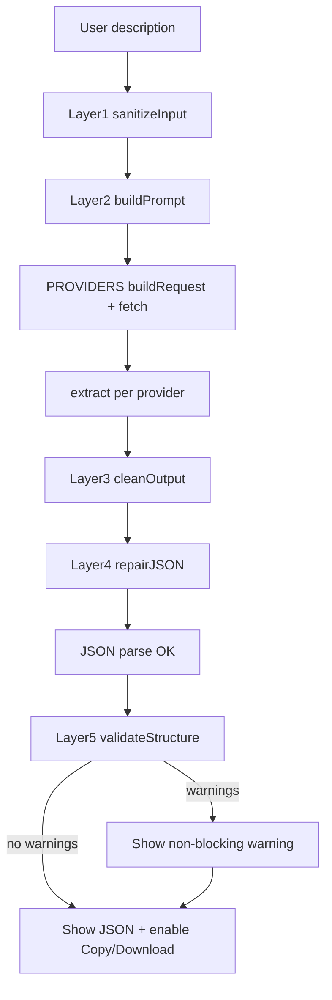

I have created the following plan after thorough exploration and analysis of the codebase. Follow the below plan verbatim. Trust the files and references. Do not re-verify what's written in the plan. Explore only when absolutely necessary. First implement all the proposed file changes and then I'll review all the changes together at the end.

## Observations

The existing `file:n8n_workflow_generator_v2.html` is a single-file vanilla JS app with: a `PROVIDERS` object (5 providers, each with `buildRequest()`/`extract()`), a hardcoded model `<select>`, inline JSON-repair in `generate()`, `copyJSON()`/`downloadJSON()`, plus CSS custom properties (`--bg`, `--green`, etc.) defining the entire look. There is no React, no Tailwind, no input sanitization, no structure validation, and API key lives only in a DOM input (never persisted). The prompt builder is inline inside `generate()`. The Custom provider already supports manual base URL + model.

## Approach

Rewrite into a single new HTML file using React + Tailwind via CDN (Babel standalone for JSX, no build tool), porting—not rewriting—the `PROVIDERS` object, JSON-repair, `copyJSON`/`downloadJSON`, and the existing CSS palette (kept in a `<style>` block so the design is preserved). Logic gets reorganized into a 5-layer pipeline (sanitize → prompt build → clean → repair → validate). Model selection becomes a populated dropdown + "Custom / Other" manual fallback. API key defaults to React state with an optional "remember" localStorage path, plus the three required security notices and a direct-connection badge.

## Implementation Instructions

### 1. New file scaffold (`file:index.html`)

Create a new single HTML file (keep `file:n8n_workflow_generator_v2.html` as the untouched reference). In `<head>`:
- Add Tailwind CDN script, React + ReactDOM CDN, and Babel standalone CDN (for in-browser JSX), plus the Inter font link from the old file.
- Copy the entire `:root` CSS variable block and all existing CSS rules from the old file's `<style>` into a `<style>` block verbatim so the palette/design is preserved. Tailwind is used only for layout convenience; the custom classes (`.card`, `.btn-primary`, `.chip`, `.status-dot`, etc.) remain the source of truth for styling.
- Add a single `<div id="root">` and a `<script type="text/babel">` containing all React code.

### 2. Port pure logic into module-level constants (top of the Babel script)

- **`PROVIDERS`**: port verbatim from old file (lines 360–438), keeping `name`, `url`, `models`, `buildRequest()`, `extract()` for `anthropic`, `openai`, `groq`, `openrouter`, `custom`. Do not change request shapes or headers (Anthropic `x-api-key`; others `Authorization: Bearer`; custom builds `<base>/chat/completions`).
- **`EXAMPLES`**: port verbatim (lines 475–481) for the quick-example chips.
- **`getNodeClass(type)`**: port verbatim (lines 642–648) for node-tag coloring.

### 3. The 5-layer pipeline as standalone helper functions

Define these as plain functions (not components) so they're testable and reused by the generate handler:

| Layer | Function | Responsibility |
|---|---|---|
| 1 | `sanitizeInput(desc)` | `trim()`; strip/neutralize prompt-injection phrases (e.g. lines containing "ignore previous instructions", "system:", role-override patterns); enforce a max length constant (e.g. `MAX_DESC = 2000`) by truncating. Return cleaned string. |
| 2 | `buildPrompt({description, name, version, complexity, lang})` | Port the prompt template from old `generate()` (lines 511–531) including the `complexityDesc` map (lines 505–509). Strengthen the mandatory instructions: output ONLY valid JSON, no markdown/backticks; required top-level keys `name, nodes, connections, active, settings`; each node must have `id, name, type, position, parameters`. |
| 3 | `cleanOutput(raw)` | Port the regex chain from line 590 (strip ` ```json `/` ``` ` prefixes and trailing backticks, then `trim()`). |
| 4 | `repairJSON(raw)` | Port the brace/bracket-balancing fallback from lines 592–606: try `JSON.parse`; on failure truncate to last `}`, count unbalanced `[`/`{`, append closers, retry; throw a friendly error if still failing. Return parsed object. |
| 5 | `validateStructure(parsed)` | NEW. Return an array of warning strings: check `Array.isArray(parsed.nodes)`, `parsed.connections` is a non-null object, and each node has `id`, `type`, `position`. Empty array = valid. Does NOT throw. |

### 4. React component tree

Single `App` component (optionally extract small presentational pieces) holding state via `useState`:

- Inputs: `description`, `wfName`, `n8nVersion`, `complexity`, `lang`.
- Provider/model: `provider`, `selectedModel`, `customModel` (manual input), `baseUrl` (custom provider only).
- API key: `apiKey`, `rememberKey` (checkbox), `showKey` (eye toggle).
- Output/status: `currentJSON`, `nodeTags`, `outputFilename`, `statusState`/`statusText`, `errorMsg`, `warnings`, `isGenerating`.

Render structure mirroring old DOM: `header` brand, `hero`, then a two-column `main` grid — left **input card** (description textarea + char count, example chips, provider/model section, API-key section, options grid, generate button, error/warning area) and right **output card** (toolbar with Salin/Download buttons, node-tags row, code/placeholder area, status bar).

### 5. Model selection (Opsi 3)

Replace the old hardcoded dropdown logic (`updateProviderUI`, lines 440–462) with React-driven rendering:
- Model `<select>` is populated from `PROVIDERS[provider].models`, with an appended `<option value="__custom__">Custom / Other</option>`.
- When `selectedModel === '__custom__'` (or provider is `custom`), show the manual `customModel` text input. Effective model = `customModel` when in custom mode, else `selectedModel`.
- For provider `custom`: show both the manual model input AND the `baseUrl` input (mirroring old `custom-url-group`).
- Update the key hint label ("opsional untuk Claude" vs "wajib") based on provider, as in line 460.

### 6. API key handling & security notices

- Default: `apiKey` lives only in React state.
- `rememberKey` checkbox: when checked, persist key to `localStorage` (e.g. key `n8n_gen_api_key`) on change; on mount, a `useEffect` reads it back only if a "remember" flag is also stored. When unchecked, remove the stored key.
- Notices (use existing muted text styling):
  1. Below the API-key input: *"API key kamu tidak pernah dikirim ke server kami. Request langsung dari browser kamu ke provider AI."*
  2. Shown only when `rememberKey` is checked: *"Key disimpan di localStorage browser ini. Jangan gunakan di komputer publik atau shared device."*
  3. A visual badge near the provider/output area: `🟢 Direct connection — {PROVIDERS[provider].name}` (reuse `.badge`/`.badge-dot` styling).

### 7. Generate handler (orchestration)

An async `handleGenerate` that wires the layers in order:
1. `sanitizeInput(description)`; if empty → set `errorMsg` and return.
2. Validate provider requirements (port lines 555–566: non-Anthropic requires key; custom requires base URL).
3. `buildPrompt(...)` → `cfg.buildRequest(model, prompt, apiKey, baseUrl)`.
4. `fetch` with the built `url/headers/body`; port the rich error extraction from lines 577–586.
5. `cleanOutput(extract(data))` → `repairJSON(...)` → pretty-print into `currentJSON`.
6. `validateStructure(parsed)` → store `warnings`; if non-empty, render a warning banner (distinct from `error-msg`, non-blocking) with text *"JSON mungkin perlu perbaikan manual sebelum di-import ke n8n"* plus the specific issues. Buttons stay enabled so the user can still download.
7. Build node tags via `getNodeClass`, set filename (port lines 626–627), set status. Manage `isGenerating` for button spinner state in `try/finally`.

### 8. Output actions

Port `copyJSON()` and `downloadJSON()` (lines 650–667) adapted to read from React `currentJSON` state instead of the DOM; keep the "✓ Tersalin" transient feedback and the Blob/object-URL download flow with the computed filename.

### Pipeline overview



### Notes
- Verify CDN availability of React, ReactDOM, Babel standalone, and Tailwind at build time (the project currently uses none of these — they are introduced per the requested stack).
- Keep all five providers and their exact request formats unchanged to preserve compatibility.
- This plan covers PRD-level features, user flow, edge cases, and the technical structure inline; no separate PRD/Spec documents are produced unless you want them as deliverables.